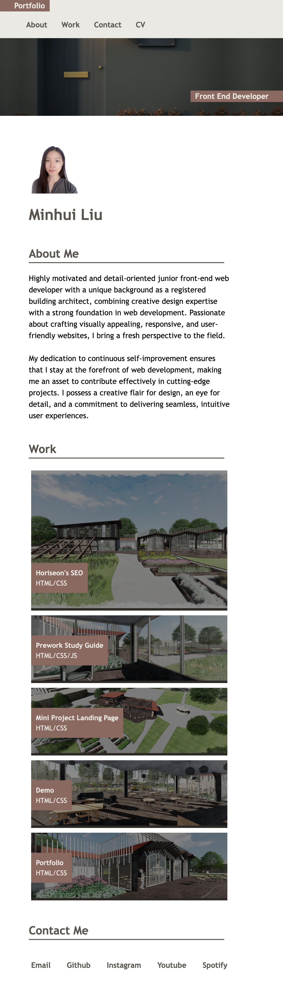

# portfolio-minhuiliu

## Description 

This portfolio-minhuiliu project was created as a portfolio of work showcasing my skills in website development for future employers to review. It contains infomation such as my name, photo, about me, my work, and contact links.

Using the basic HTML and CSS starter files provided by the course, I've integrated the recently acquired skills of flexbox, media queries, variables, and responsive design into this project, detailed below:
- Implementing a flex display to structure the various sections.
- Utilising a grid display to organize different projects within the 'Work' section and visually emphasize the primary project by presenting it prominently in a larger grid.
- As the page adjusts to different screen sizes and devices, its layout becomes responsive, seamlessly adapting to any viewport. 
- Upon clicking the work images, users are directed to the respective deployed application or github repository.

Link to the deployed web: https://itismliu.github.io/portfolio-minhuiliu/

Link to github repository: https://github.com/ItIsMLiu/portfolio-minhuiliu

Screenshot of webpage when screen width is larger than 1000px:

Screenshot of webpage when screen width is between 600-1000px:

Screenshot of webpage when screen width is smaller than 1000px:

## Installation

N/A

## Usage 

To use the portfolio webpage, you can go through its various sections to explore infomation about me, my work, and my contact details. If you wish to review a specific section without having to scroll through the entire page, simply utilise the navigation bar located at the top right corner. From there, select one of the four options: 'About,' 'Work,' 'Contact' or 'CV' by clicking on your choice. This will promptly take you to the desired section on the webpage, where you can delve into the section contents.

This webpage is compatible with various screen sizes, as its layout will automatically respond and adapt. 

The graphics of the links in the navigation bar, the 'contact me' section, and images in the 'work' section will dynamically change as you hover the cursor over them.

## Credits

A starter code pack, comprising basic HTML and CSS codes (please refer to the 2nd commit) was provided by the course edx. We have been granted permission to modify and add to the code.

Other resources used as guides:
- Readme file: https://coding-boot-camp.github.io/full-stack/github/professional-readme-guide
- onclick link: https://www.geeksforgeeks.org/how-to-make-the-background-of-a-div-clickable-in-html/;
- Filter background image: https://www.w3schools.com/howto/howto_css_blurred_background.asp; https://www.w3schools.com/cssref/css3_pr_filter.php;
- Transition: https://developer.mozilla.org/en-US/docs/Web/CSS/transition

## License

MIT license (Please refer to the LICENSE in the repository).